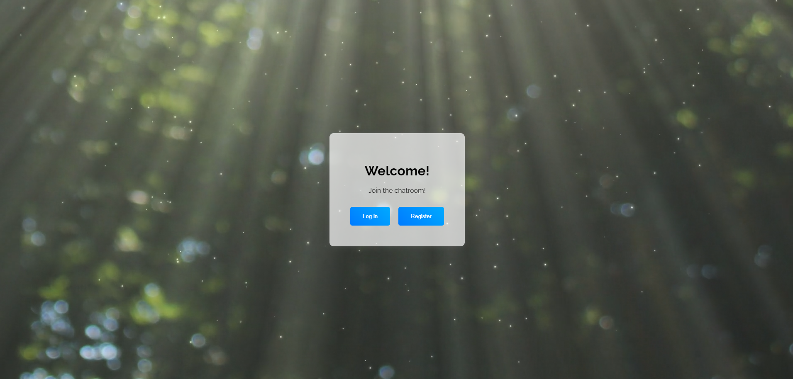
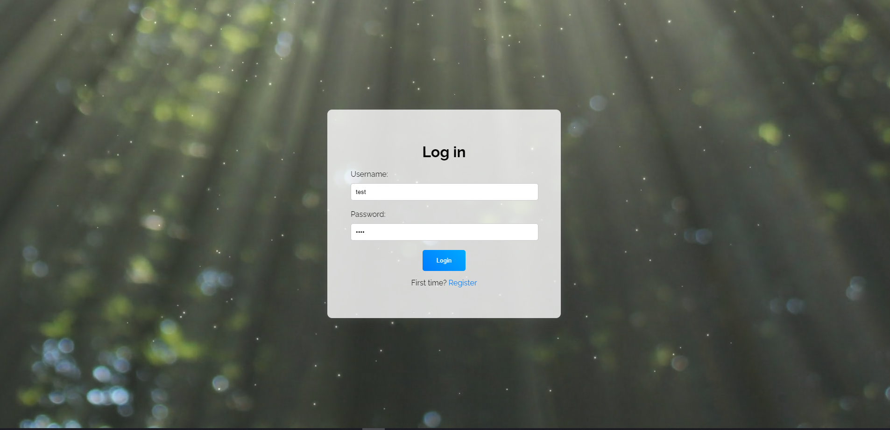
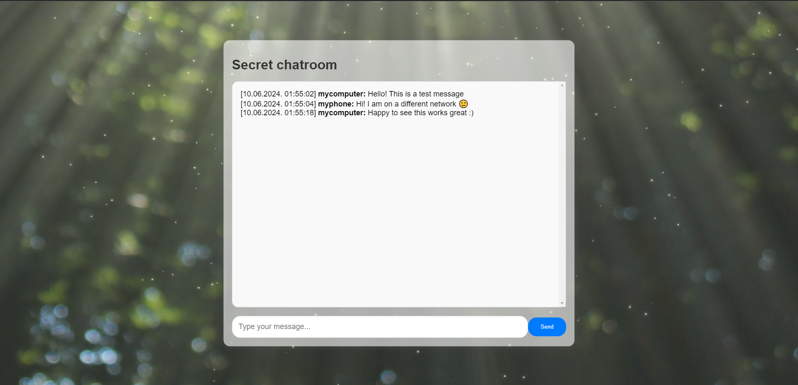

# Flask Chatroom Project

This project is a simple chatroom web application built using Flask, a lightweight Python web framework. It allows users to register, log in, and participate in real-time chat conversations.

## Functionality

- **User Registration**: Users can create an account by providing a unique username and password.
- **User Authentication**: Registered users can log in securely using their credentials.
- **Chatroom Access**: Authenticated users can access the chatroom, where they can view and participate in chat conversations.
- **Real-time Chat**: Messages sent by users are displayed in real-time to all participants in the chatroom.
- **Message Persistence**: Chat messages are stored in a SQLite database, allowing for message retrieval and history.

## Demo

Landing page



Log in page



Chatroom



## Technology Used

- **Flask**: The web application framework used for building the backend server.
- **SQLite**: A lightweight relational database used for storing user information and chat messages.
- **HTML/CSS/JavaScript**: Used for building the frontend user interface and interactions.
- **ngrok**: An external tool used for exposing the local Flask server to the internet, enabling remote access to the chatroom.

## Directory Structure

The project directory structure is as follows:
```
project/
│
├── app.py
├── create_table_user_logins.py
├── chatroom_data.db
├── static/
|   ├── media/
|   |   └──background.mp4
│   ├── chatroom_style.css
|   └── chatroom.js
├── templates/
│   ├── landing.html
│   ├── chatroom.html
│   ├── login.html
│   └── register.html
├── data/
|   └── messages.json
├── README.md
└── requirements.txt
```


## Running the Application

1. Install Python and required dependencies by running `pip install -r requirements.txt`.
2. Run the Flask application using `python app.py`.
3. Access the chatroom by visiting `http://localhost:8080` in your web browser.
4. Use ngrok to make the chatroom accessible over the internet if needed.

## Hosting on Public Web

You can host this Flask chatroom project on a public web server using services like ngrok for temporary hosting or deploying it to a cloud platform like Heroku, AWS, or DigitalOcean for permanent hosting.

To host it temporarily using ngrok:
1. Install ngrok and run it with `ngrok http 8080` (replace `8080` with your Flask app's port).
2. Share the ngrok-generated URL with others to access the chatroom over the internet.

